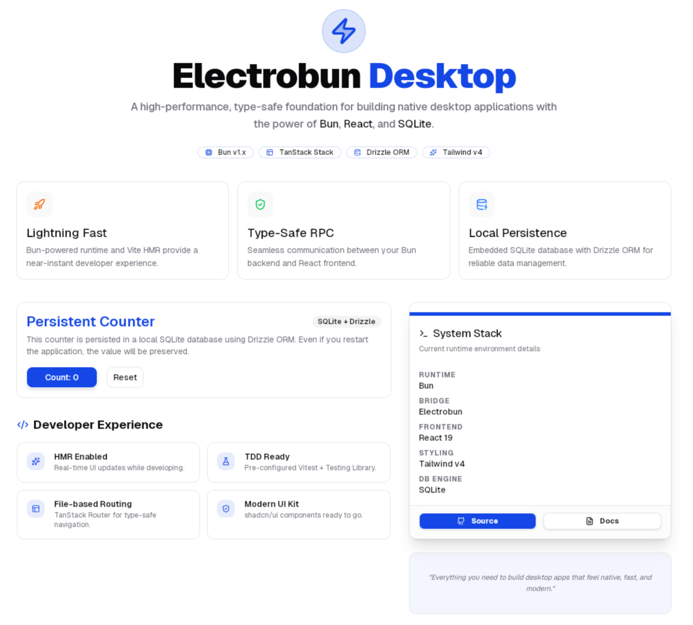

# BunStack Desktop



### Electrobun + TanStack + shadcn/ui + Drizzle ORM

A high-performance, enterprise-grade desktop application boilerplate. This template combines the speed of **Bun** and **Electrobun** with the power of the **TanStack** ecosystem, the elegance of **shadcn/ui**, and the type-safety of **Drizzle ORM**.

## 🚀 Tech Stack

- **Native Wrapper:** [Electrobun](https://electrobun.dev/) (Lightweight, fast alternative to Electron)
- **Runtime & Package Manager:** [Bun](https://bun.sh/)
- **Frontend Framework:** [React](https://react.dev/)
- **Routing:** [TanStack Router](https://tanstack.com/router) (File-based, type-safe routing)
- **Data Management:** [TanStack Query](https://tanstack.com/query) & [Electrobun RPC](https://electrobun.dev/docs/rpc)
- **Database:** [SQLite](https://bun.sh/docs/api/sqlite) via [Drizzle ORM](https://orm.drizzle.team/)
- **UI Components:** [shadcn/ui](https://ui.shadcn.com/) (Radix UI)
- **Styling:** [Tailwind CSS v4](https://tailwindcss.com/)
- **Testing:** [Vitest](https://vitest.dev/) & [React Testing Library](https://testing-library.com/docs/react-testing-library/intro/)

## ✨ Key Features

- **Lightning Fast HMR:** Powered by Vite and Electrobun's dev server integration.
- **Type-Safe RPC:** Seamless communication between your Bun backend and React frontend.
- **Persistent Storage:** Built-in SQLite database with Drizzle ORM. Data is stored in `~/.electrobun-react-tailwind-vite/sqlite.db` by default. You can customize this path using the `SQLITE_DB_PATH` environment variable in a `.env` file.
- **Modern Routing:** File-based routing with TanStack Router.
- **TDD Ready:** Pre-configured Vitest setup for testing both UI and database logic.
- **Responsive UI:** Modern components with shadcn/ui and Tailwind CSS v4.


## 🛠️ Getting Started

### Prerequisites

- [Bun](https://bun.sh/) installed on your system.

### Installation

```bash
bun install
```

### Development

For the best experience, use the HMR (Hot Module Replacement) command:

```bash
# Recommended: Starts Vite HMR server and Electrobun
bun run dev:hmr

# Standard dev mode (re-bundles assets on change)
bun run dev
```

### Building for Production

```bash
# Build Vite assets and Electrobun binary
bun run build:canary
```

## 📂 Project Structure

```
├── src/
│   ├── bun/                # Main process (Electrobun/Bun)
│   │   └── index.ts        # Database setup, migrations, and RPC handlers
│   ├── db/                 # Drizzle schema and database initialization
│   ├── shared/             # Shared types and RPC schemas
│   ├── mainview/           # UI Layer (WebView)
│   │   ├── routes/         # TanStack Router file-based routes
│   │   ├── main.tsx        # React entry point
│   │   └── index.css       # Tailwind CSS v4 entry
│   ├── components/         # React components (including shadcn/ui)
│   └── __tests__/          # Vitest test suites
├── drizzle/                # Generated SQL migrations
├── electrobun.config.ts    # Electrobun configuration
├── vite.config.mts         # Vite configuration (Tailwind v4 plugin)
└── drizzle.config.ts       # Drizzle Kit configuration
```

## 🧪 Testing

The project is built with **Test-Driven Development (TDD)** in mind.

```bash
# Run all tests
bun run test

# Run type-checking
bun run typecheck
```

## 📘 Architecture Note

This application utilizes a bridge between two processes:
1. **The Bun Process:** Handles the OS-level logic, file system, and database access via SQLite/Drizzle.
2. **The WebView:** Runs the React application and communicates with the Bun process via the **Electrobun RPC** protocol.

This separation ensures high performance and security while maintaining a familiar web development workflow.

---

Built with ❤️ using [Electrobun](https://electrobun.dev/).
